# CodeMirror

<!-- TOC depthFrom:1 depthTo:6 withLinks:1 updateOnSave:1 orderedList:0 -->

- [CodeMirror](#codemirror)
	- [Introdução](#introduo)
	- [Evolução do Sistema](#evoluo-do-sistema)
	- [Como usar: uso básico](#como-usar-uso-bsico)
	- [Carregadores de Módulo](#carregadores-de-mdulo)
	- [Configuração](#configurao)
	- [Eventos](#eventos)
	- [Atalhos de teclado (keymaps)](#atalhos-de-teclado-keymaps)
	- [Comandos](#comandos)
	- [Personalização](#personalizao)
	- [API](#api)

<!-- /TOC -->
## Introdução

CodeMirror é um componente de editor de código que pode ser incorporado em páginas da Web. Sua biblioteca central fornece apenas o componente do editor, sem botões, auto-complete ou outra funcionalidade de IDE. Ele fornece uma API rica na qual essa funcionalidade pode ser implementada diretamente.

CodeMirror funciona com *Modos* específicos de idioma. Tais modos são programas JavaScript que mudam a cor do texto escrito em um determinado idioma. A versão padrão já vem com uma quantidade de modos e não é difícil escrever novos para outros idiomas que ainda não estão incluídos.

As principais características do sistema incluem suporte para mais de 100 linguagens, sendo necessário apenas carregar os arquivos de módulo referente a cada linguagem para que a mesma se torne disponível ao CodeMirror. Permite ainda customizar o comportamento de tags específicas, verificar se a abertura e o fechamento de tags são compatíveis, combinar tipos de fonte e estilos, apresentar interfaces de busca e alteração, entre outras características que serão apresentadas e descritas ao longo deste documento.

A Figura 1 ilustra um exemplo de utilização do CodeMirror para a criação de uma simples instância. Ao longo desta documentação, outros exemplos serão apresentados com suas respectivas funções.

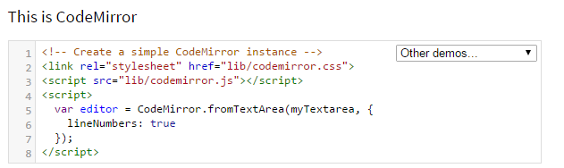
>*Figura 1*

## Evolução do Sistema
O sistema apresenta até o momento um total de 104 *releases*, tendo a versão 5.25.2 como a atual, lançada no dia 20/04/2017. As primeiras versões beta do sistema foram lançadas em Fevereiro de 2011, enquanto a versão *Release Candidate*, CodeMirror 2, ficou disponível a partir do mês de Março do mesmo ano. A partir de então, releases frequentes até a versão atual foram lançadas com o objetivo de solucionar problemas existentes e adicionar, alterar, e/ou remover funcionalidades existentes com uma frequência média mensal. Os dados abaixo sobre a evolução do sistema foram obtidos no dia 18 de maio de 2017. Até a presente data, algumas informações, como quantidade de *releases*, podem ter mudado.

Analisando primeiramente a evolução do número de colaboradores através da Figura 2 que apresenta os dados da Janeiro de 2011 até Maio de 2017, observamos que o pico de colaboradores acontece nos anos iniciais do sistema, observando uma tendência decrescente nos últimos anos. O usuário com o maior número de commits, *marijnh*, possui 3.971 commits, seguido por *mightyguava*, com apenas 130. O número total de colaboradores é 645. Veja o gráfico a seguir:

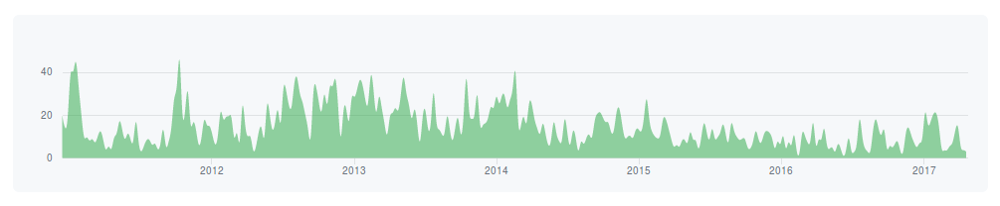
>*Figura 2*

Considerando apenas o intervalo de tempo que compreende o período entre 19 de Maio de 2016 a 18 de Maio de 2017, selecionado na Figura  3, temos que o usuário marijnh mantém sua colaboração alta, com 315 commits, seguido agora por adrianheine, com 62 commits no total.

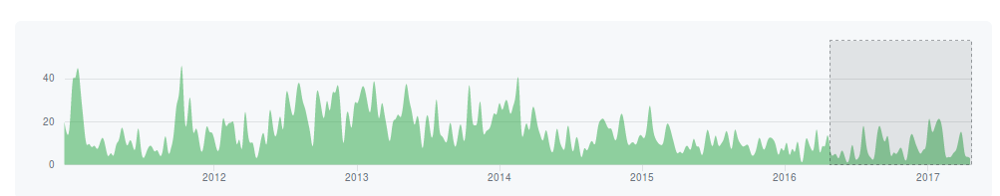
>*Figura 3*

Novos colaboradores contam com uma [plataforma de discussão](https://discuss.codemirror.net/) que pode ser utilizada para reportar bugs, tirar dúvidas e levantar questões. Bugs devem ser reportados preferencialmente pelo [*GitHub issue tracker*](https://github.com/codemirror/CodeMirror/issues). Os atuais colaboradores do projeto podem usar uma ferramenta de chat chamada [Gitter]( https://gitter.im/codemirror/CodeMirror) para se comunicar de forma mais eficiente e em tempo real. Com essa ferramenta é possível abrir novas questões (*issues*) e outros usuários podem comentar nelas e/ou marcá-las como resolvidas. Um exemplo está na figura 4, onde o usuário opl abriu uma requisição de número 4753 e, posteriormente, o usuário *marijnh* a fechou (provavelmente resolveu o problema) e fez um comentário.

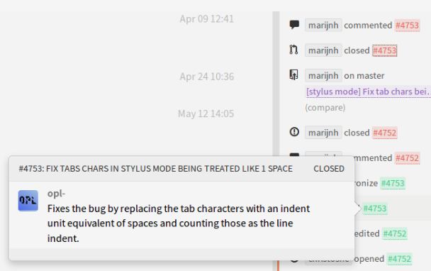
>*Figura 4*

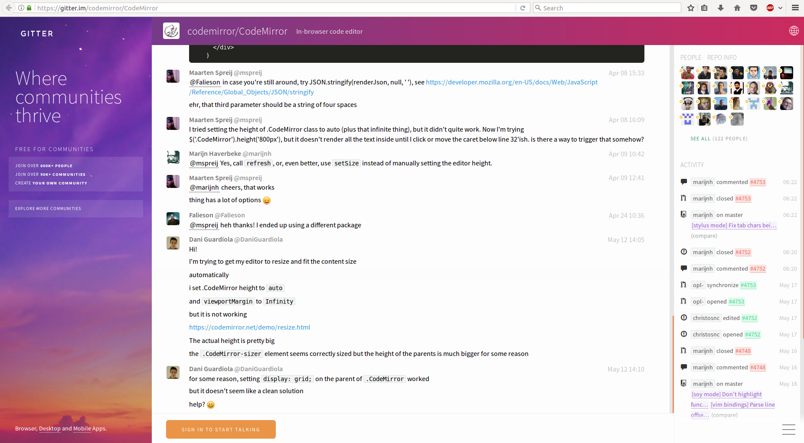
>*Figura 5*

Apesar do número de contribuintes apresentar uma tendência decrescente, como já apresentado acima, o número de commits mostra-se constante, com alguns picos em algumas semanas. A Figura 4, que contém a quantidade de tweets por semana feitos durante o último ano, apresenta esse comportamento.

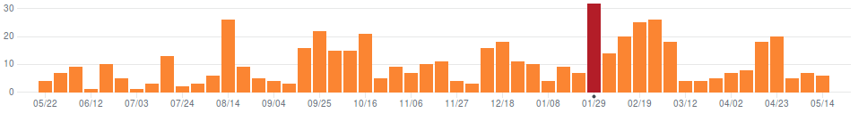
>*Figura 6*

A Figura 7 mostra a quantidade de código que foi incluída ou excluída no projeto por semana desde o começo. Observe que o número de linhas de código adicionadas tende a ser apenas um pouco maior que o número de linhas de códigos deletadas. Com o passar do tempo e consequente estabilização do projeto e redução do número de colaboradores, a frequência de alterações tem diminuído, apesar de notarmos um pico entre os anos de 2016 e 2017. Atualmente, 80,3% do código é escrito JavaScript, 15,9% é HTML e 3,8% em CSS.

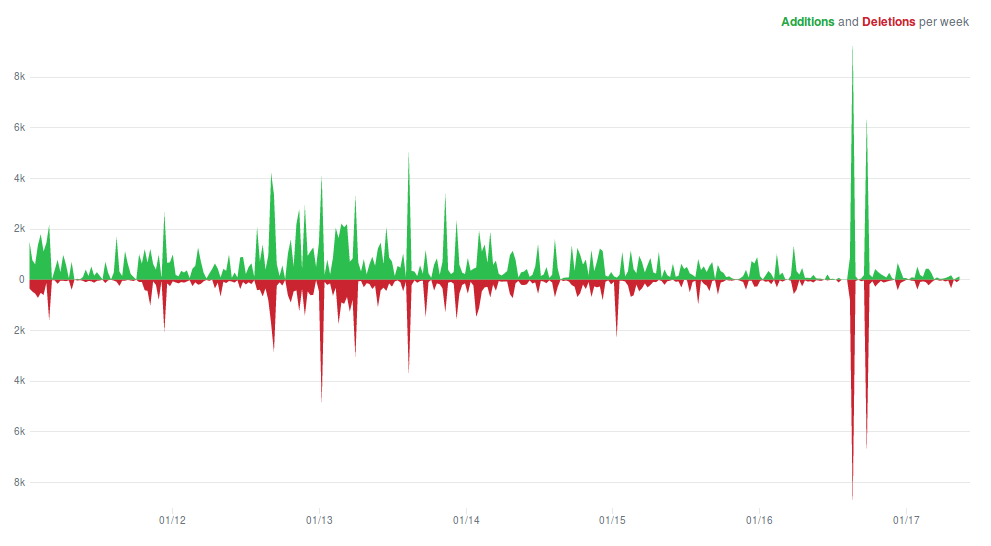
>*Figura 7*

Uma análise final referente ao número de commits está relacionado aos horários dos dias da semana. A Figura 8 apresenta uma visualização dessa análise, onde quanto maior o círculo maior o número de commits. Observe que o maior número de commits acontece durante parte da manhã e tarde de dias úteis da semana.

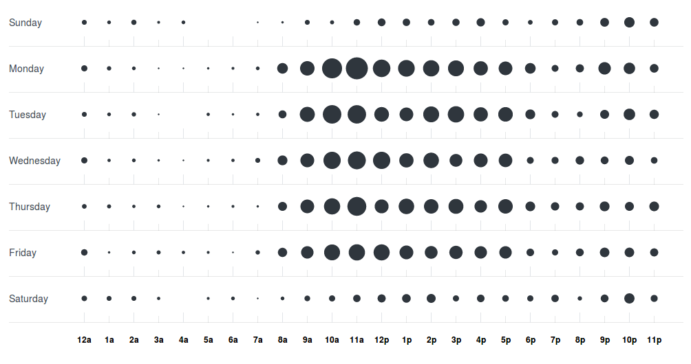
>*Figura 8*

## Como usar: uso básico
O jeito mais fácil de fazer uso do CodeMirror é carregando um *script* e a *style sheet* (que pode ser encontrada em lib/), junto com um script de modo de algum dos diretórios mode/. Exemplo:

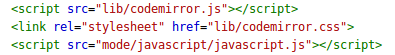
>*Figura 9*

É possível também usar o “module loader”, ou carregador de módulo (veja no próximo tópico).

Após ter feito isso, uma instância do editor pode ser criada assim:

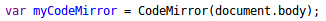
>*Figura 10*

O editor será anexado ao corpo do documento, começará vazio e irá usar o modo que foi carregado. Para ter mais controle sobre o novo editor, um objeto de configuração pode ser passado para CodeMirror como um segundo argumento:

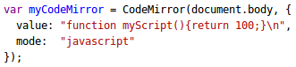
>*Figura 11*

Essa função irá inicializar o editor com um pedaço de código já nele, e explicitamente dizer-lhe para usar o modo JavaScript (que é útil quando vários modos são carregados).

## Carregadores de Módulo
Carregadores de Módulo
Os arquivos no CodeMirror contém bibliotecas auxiliares para carregá-los em ambientes AMD ou *CommonJS*. Se as variáveis *exports* e *module* já existirem como objetos, o estilo de CommonJS será usado. Caso contrário estilo AMD será usado.

É possível usar *Browsefy* ou outras ferramentas similares para criar módulos de forma estática usando o CodeMirror. Como uma alternativa, use *RequireJS* para carregar as dependências dinamicamente durante o tempo de execução. Ambas ações têm como vantagem o fato de não usar namespace global e podem, assim, fazer coisas como carregar várias versões do CodeMirror ao lado uma das outras.

Um exemplo de como usar RequireJS para carregar o CodeMirror

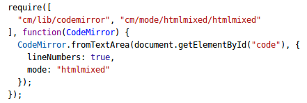
>*Figura 12*

## Configuração
Tanto a função do CodeMirror quanto seu método *fromTextArea* usam como segundo argumento (que é opcional) um objeto que contém as opções de configurações. Qualquer opção que não é fornecida desta forma será retirado de *CodeMirror.defaults*, que é um objeto que contém as opções padrão. É possível atualizar o objeto para mudar as características padrão da sua página.

Algumas das opções suportadas:
- **value**: é o valor inicial do editor. Pode ser tanto uma string quanto um objeto de documento.
- **mode**: é o modo de usar. Quando ele não é dado, será definido como padrão o primeiro modo que foi carregado.
- **lineSeparator**: define explicitamente o separador de linha do editor.
- **theme**: é o estilo do editor. É preciso ter certeza que o arquivo CSS correspondente ao estilo está carregado. É possível usar várias classes de tema de uma só vez.
- **indentUnit**: é a quantidade de espaços um bloco deve ser identado. O padrão é 2 por definição.
- **smartIndent**: define se deve ser usada a indentação sensível ao contexto que o modo fornece.
- **tabSize**: é a largura do caractere tab. Por definição é 4.
- **indentWithTabs**: define se, quando indentando os primeiros N* tabSize os espaços serão substituidos por N tabs.

Existem também várias outras opções como *electricChars, specialChars, keyMap, specialCharPlaceholder, rtlMoveVisually, extraKeys, lineWrapping, lineNumbers, workDelay, firstLineNumber, lineNumberFormatter, gutters, fixedGutter, scrollbarStyle, inputStyle, readOnly, coverGutterNextToScrollbar, showCursorWhenSelecting, lineWiseCopyCut, undoDepth, historyEventDelay, tabindex, autofocus, dragDrop, allowDropFileTypes, cursorBlinkRate, workTime, cursorScrollMargin, cursorHeight, resetSelectionOnContextMenu, pollInterval, flarrenSpans, addModeClass, maxHighLength e viewportMargin.*

É possível notar como o CodeMirror é personalizável.

## Eventos
Vários objetos relacionados ao CodeMirror emitem eventos que permitem que o código do cliente reaja a várias situações. Manipuladores para tais eventos podem ser inicializados com os métodos *on* e *off*. Para acionar seus próprios eventos, use *CodeMirror.signal(target, name, args…).*

Uma instância de editor aciona os seguintes eventos: *change, changes, beforeChange, cursorActivity, keyHandled, inputRead, electricInput, beforeSelectionChange, viewportChange, swapDoc, gutterClick, gutterContextMenu, focus, blur, scroll, refresh, optionChange, scrollCursorIntoView, update, renderLine, mousedown, dbclick, touchstart, contextmenu, keydown, keypress, keyup, cut, copy, paste, dragstart, dragenter, dragover, dragleave, drop.*

Objetos de documento emitem os seguintes eventos: *change, beforeChange, cursorActivity, beforeSelectionChange, delete, change, beforeCursosEnter, clear, hide, unhide, redraw.*

## Atalhos de teclado (keymaps)
Os *keymaps* são formas de associar chaves a funcionalidades. Um *keymap* é um objeto que mapeia strings para identificar as chaves para funções que implementam suas funcionalidades. O CodeMirror possui os atalhos presentes nos editores *Emacs, Vim e Sublime Text* como estilos pré-definidos.

Chaves são identificadas pelo seu nome ou caractere. O objeto *CodeMirror.keyNames* define nomes para chaves comuns e os associam a códigos de chave. Exemplos de nomes são *Enter* e *F5*. Eles podem ter como prefixo *shift-, cmd-, ctrl-* ou *alt-* para algum modificador específico.

Um exemplo é o mapeamento da tecla tab para inserir espaços ao invés do caractere tab.

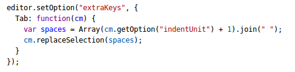
>*Figura 13*

Devido a limitações às formas como navegadores acionam os eventos-chave, eles podem não ser prefixados com modificadores.

As combinações de teclas com vários movimentos (multi-stroke) podem ser especificadas separando os nomes das chaves por espaços no nome da propriedade, por exemplo ctrl-x ctrl-v. Quando um mapa contém ligações multi-stroke ou chaves com modificadores que não são especificados na ordem padrão (shift-cmd-ctrl-alt), é necessário chamar *CodeMirror.normalizeKeyMap* antes da ação ser usada. Essa função faz com que um mapa-chave e seus modificadores normalizem a ordem de prioridade e reconheçam o atalho multi-stroke. A função retorna o mapa.

O objeto *CodeMirror.keyMap* é responsável por associar os mapas-chave com seus nomes. Definições de código do usuário e de mapas-chave podem colocar propriedades extras neste objeto. Em todos os locais onde um mapa-chave é esperado, uma string pode ser adicionada. O objeto também contém o mapa-chave *default*.

As propriedades em mapas-chave podem ser funções de um único argumento, strings ou *false*. Strings fazem referência a comandos. Se uma propriedade é definida como *false*, o CodeMirror deixa com que o navegador seja o responsável pela chave.

Mapas-chave para comandos cujo nome começa com os caracteres *“go”* ou para funções que tem uma propriedade *motion* serão acionados quando um shift extra estiver presente. Exemplo: *“up”* : *“goLineUp”* pode ser usado com up e com shift-up. Tal procedimento é usado para facilitar a implementação da seleção do shift.

Mapas-chave podem diferir uns aos outros usando uma propriedade *fallthrough*. Isso indica que quando a chave não é encontrada no mapa, um ou mais mapas devem ser pesquisados. Ele consegue fazer isso com um único mapa-chave ou um vetor de mapas-chave. Quando um mapa-chave precisa de definir algo ao ficar ativo, ou destruir ao ficar desativo, ele pode contar as propriedades *attach* e/ou *detach*.

## Comandos
Comandos são ações sem parâmetro que podem ser feitas em um editor. Eles são muito usados através de atalhos do teclado. Comandos são definidos ao adicionar propriedades no objeto *CodeMirror.commands*. Certa quantidade de comandos comuns é definida na biblioteca, a maioria destes comandos é usado por atalhos do teclado padrão.  O valor de uma proriedade de comando deve ser uma função com um único argumento. Alguns dos comandos mostrados abaixo são referenciados no mapa-chave padrão, mas não são definidos na biblioteca central. Eles estão destinados a serem definidos pelo código do usuário. Comandos também podem rodar com o método *execCommand*.

Alguns comandos:

| Comando | Definição | Atalho |
|:----------------:|:---------------------------------------------------------------------------------:|:--------------------------------------------:|
| selectAll | Seleciona todo o conteúdo do editor | Ctrl-A (PC), Cmd-A (Mac) |
| singleSelection | Quando se tem várias seleções, ele des-seleciona todos, exceto a principal | Esc |
| killLine | Deleta a parte da linha que está atrás do cursor | Ctrl-K (Mac) |
| deleteLine | Apaga toda a linha abaixo do cursor, incluisive novas linhas que existirem no fim | Ctrl-D (PC), Cmd-D (Mac) |
| undo | Desfaz a última modificação | Ctrl-Z (PC), Cmd-Z (Mac) |
| redo | Refaz a última modificação que foi desfeita | Ctrl-Y (PC), Shift-Cmd-Z (Mac), Cmd-Y (Mac) |
| undoSelection | Desfaz a última modificação que foi feita na seleção | Ctrl-U (PC), Cmd-U (Mac) |
| redoSelection | Refaz a última modificação que foi feita na seleção | Alt-U (PC), Shift-Cmd-U (Mac) |
| goDocStart | Move o cursor para o começo do documento | Ctrl-Home (PC), Cmd-Up (Mac), Cmd-Home (Mac) |
| goDocEnd | Move o cursor para o fim do documento | Ctrl-End (PC), Cmd-End (Mac), Cmd-Down (Mac) |
| goLineStart | Move o cursor para o início da linha | Alt-Left (PC), Ctrl-A (Mac) |
| goLineEnd | Move o cursor para o fim da linha | Alt-Right (PC), Ctrl-E (Mac) |
| goWordLeft | Move o cursor para o começo da palavra anterior | Alt-B (Mac) |
| goWordRight | Move o cursor para o final da próxima palavra | Alt-F (Mac) |
| indentAuto | Indenta automaticamente a atual linha ou seleção | Shift-Tab |
| transposeChars | Troca os caracteres antes e depois do cursor | Ctrl-T (Mac) |
| newlineAndIndent | Insere uma nova linha auto-indentada | Enter |

## Personalização
Até determinado ponto a aparência do CodeMirror pode ser modificada, basta alterar as folhas de estilo. As folhas de estilo provém as cores do modo e podem ser adaptadas de uma forma bem direta. Para personalizar o editor basta alterar ou sobrepor os estilos que estão definidos em *codemirror.css.*

Se a folha de estilo da sua página fizer coisas sem sentido com todos os elementos *div* ou *pre*, você terá que definir regras para cancelar ester efeitos. Temas também são arquivos CSS simples que definem cores para vários elementos estáticos. É possível vê-los na pasta *theme*.

Alguns cuidados devem ser tomados, já que várias regras neste arquivo são usadas para fazer com que o CodeMirror funcione. Ajudar as cores não causa problemas e com certo cuidado várias outras coisas podem ser mudadas também. As classes CSS que estão definidas no arquivo segue as seguintes funções:

- *CodeMirror*: é o elemento externo do editor. Ele deve ser usado para altura, largura, bordas e posicionamento do editor. Podem também ser usado para definir estilos que devem conter tudo dentro do editor, como os estilos e tamanhos da fonte, ou para definir um plano de fundo.
- *CodeMirror-focused*: essa classe é usada para esconder o cursor e dar uma cor diferente para a seleção quando o editor não está selecionado.
- *CodeMirror-gutters*: é usado para definir a cor de fundo padrão das calhas do programa.
- *CodeMirror-linenumbers*: é usado para dar um plano de fundo ou largura para a calha que contém o número das linhas.
- *CodeMirror-linenumber*: é usado para modificar os números das linhas individualmente.
- *CodeMirror-lines*: são as linhas visíveis. Aqui é onde você pode especificar o preenchimento vertical para o conteúdo do editor.
- *CodeMirror-cursor*: você pode fazer com que o cursor fique da maneira que você quiser.
- *CodeMirror-selected*: a seleção é representada por elementos span.
- *CodeMirror-matchingbracket, CodeMirror-nonmatchingbracket*: é usado para estilizar os colchetes.

## API
Muitas características do CodeMirror só estão disponíveis através de APIs. É preciso escrever códigos ou usar addons se você quiser deixá-las expostas para os usuários. Sempre que pontos no documento são representados, a API usa objetos com propriedades de* line* e *ch*. Se você atribuir algum valor nulo à *ch* ou não especificá-lo, ele será substituído pelo comprimento da linha especificada.

Alguns métodos que podem ser usados:
- ***Constructor***: é possível construir uma instância de editor com o construtor *CodeMirror(place: Element|fn(Element), ?option: object)*. Se o argumento *place* é um elemento DOM, o editor será anexado a ele. Se for uma função, ele será chamado e deve colocar o editor no documento. option deve ser um elemento que mapeia os valores de *option names*. As opções que não forem especificadas de forma explícita serão retirados de *CodeMirror.defaults*.
- ***Content manipulation methods***
- ***Cursor and selection methods***
- ***Configuration methods***
- ***Document management methods***
- ***History-related methods***
- ***Text-marking methods***
- ***Widget, gutter and decoration methods***
- ***Sizing, scrolling and positioning methods***
- ***Mode, state and token-related methods***
- ***Miscellaneous methods***
- ***Static properties***
